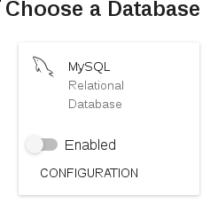
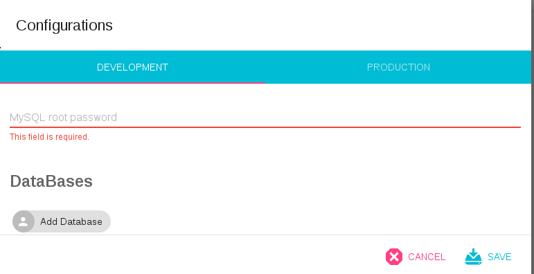
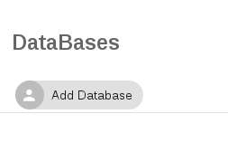
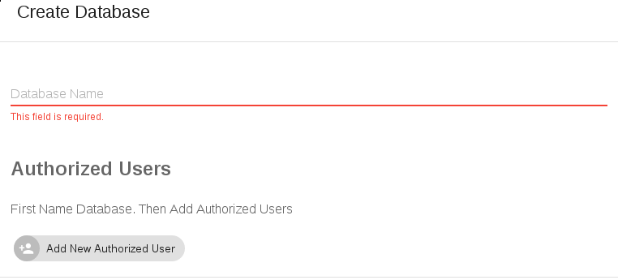
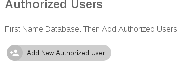
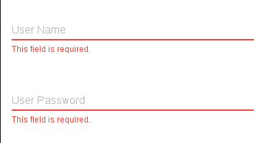
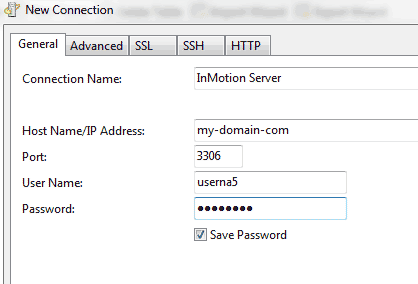

Steps
===
  * 1. Activate MySQL module when Creating a Project.
  * 2. Configure further
    - 2.1 Root password
    - 2.2 Create Database
    - 2.3 Add Users
  * 3. Access

MySQL
===

## 1. Activate MySQL module when Creating a Project.

Click the "Enabled" button.



## 2. Configure further

Click the "Configuration" section.

### 2.1 Type a root password for your environment (Choose the desired tab).

Remember. It should be a secure password!



### 2.2 Create a Database

This is important for you to access it remotely or manage it as you wish.



Type the name of your desired Database. The one you'll connect with your app!



### 2.3 Add authorized Users to your DB

Not everyone is allowed to access your DB, is it? Manage that here!

Click  the **"Add New Authorized User"** button.



Now add a username and password.



## You're all set! Click save.


## 3. Now What? Access

You can access your database using either:

```
mysql -u fooUser -p -h 44.55.66.77
```

or your desired Database manager. 

Some of the most common are Navicat. (among others).

For example:



# Troubles?

### Find us in tinkerware-support.tinkerware.io

## Do you need to manage more variables? Let's talk! 

We make available the most requested variables. 

We are looking for both flexibility and make it easy for you.


Let's talk! Or write us a mail to hello@tinkerware.io and let us know what you think.
